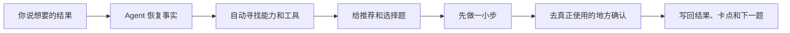

  

<h1 align="center">流口水 Skill 🤤</h1>

  <strong>把烧脑的 AI 项目，变成流着哈喇子也能做的选择题。</strong> 
  给不懂产品、不懂代码，也想把复杂事情一步步做完的普通人 
  English name: Halazi Skill

  <code>公开预览中</code> · <code>尚不可安装</code> · <code>上游方法试运行</code>

> Agent 指替你执行任务的 AI 助手。这个仓库现在能看、能讨论，但还不是可以安装的成熟 Skill。

## 为什么叫“流口水”

我想让没有产品和技术背景的人，也能把要聊很多轮、分很多步才能做完的 AI 项目推下去。

不是先把自己训练成产品经理、技术负责人和项目经理，才有资格使用 AI；而是让 Agent 先把查资料、找工具、比较路线、排风险和验收这些烧脑功课做完，再把真正需要你决定的事情变成少量选择题。

**你负责说想得到什么、选择取舍；Agent 负责把路查清、把活推进、把结果验真。**

## 先说清楚：它解决什么

> **解决什么**
> 长项目跨对话后失忆、AI 把专业问题甩回给用户、工具越装越多却不知道怎么配合，以及代码和测试被误报成真实交付。

> **Leo 做了什么**
> 从真实项目的失败和阶段成果里，逐步抽出当前事实、工作包、能力路由、时间约束、异常、验收和待回复机制，再把这些组织能力翻译成普通人能回答的选择题。

> **现在有什么**
> 已迁入“苦难行军”的完整方法内核、模板和发布边界；流口水式交互、可安装 Skill 和具体能力路由仍在制作与验证。

> **还没证明什么**
> 目前不能宣称已经可安装、兼容所有 Agent、适合所有项目，也不能把上游试运行当成 Halazi Skill 已经真实通过。

## 你是不是也被 AI 反问过这些

- “请先写一份完整需求。”——可我根本不知道需求该怎么写。
- “请选择技术路线。”——我要是会选，还找你干什么？
- “请选择一个 Skill 或工具。”——我连它们分别干什么都不知道。
- “测试已经通过。”——所以我现在到底能不能真的用？
- “下一步是……”——说完就停了，过两天整个项目又失忆。

如果每次使用 AI，都要先学会产品、代码和项目管理，AI 并没有真正帮普通人降低门槛。

## Before → After

| 以前 | 流口水 Skill 想做到 |
| --- | --- |
| AI 让你自己写需求 | Agent 先查现状，再把不清楚的地方变成选择题 |
| 你自己研究该用哪个工具 | Agent 自动寻找、比较和组合能力，只解释为什么这样选 |
| 一堆任务都在“推进” | 只告诉你现在过哪一关、卡在哪里、谁来继续 |
| 代码写完或测试通过就算完成 | 必须走真实用户路径，并在目标端反查结果 |
| 新消息把旧问题顶没了 | 未回答的问题持续可见，直到回答、撤回或失效 |

## 选择题会长这样

> **交互示意，不是已经发生的真实案例**
>
> **现在只需要你选一题：第一版先证明什么？**
>
> **A. 先跑通一个真实用户路径（推荐）** 
> B. 先把所有功能做齐 
> C. 先做一个好看的展示版本
>
> **为什么推荐 A：** 最快知道这条路到底能不能给人使用。 
> **好处：** 少走弯路，失败也能尽早换路线。 
> **代价：** 第一版不会功能很多，也不一定好看。 
> **你只需回复：** A、B 或 C。

真正的选择题不会让你盲猜。Agent 必须先给推荐、理由、好处和代价；能从环境查到的事实，不拿来考你。

## 它不是一个只会出选择题的 Prompt

选择题只是你握着的方向盘；“苦难行军”提炼出的组织能力才是底盘。

背后保留三层能力：

1. **项目不会失忆（推进内核）：** 目标、当前卡点、已经失败的路和下一步都能找回来。
2. **Agent 不把难题甩给你（协作约定）：** 它先查清、说人话，只把真正的取舍交给你。
3. **Agent 会自己找路和工具（能力路由）：** 知道什么时候该访谈、调研、诊断、复核、验收或换路。

完整规则见 [METHOD.md](METHOD.md)，可复制的工作模板见 [TEMPLATES.md](TEMPLATES.md)。

## 它会守住什么

1. **先给推荐，再给选项。** 每道选择题都说明推荐、理由、好处和代价。
2. **用户不负责研究工具。** Agent 自动选择需要的能力，并用一句人话解释正在做什么。
3. **能安全推进就直接推进。** 只有结果取舍、付费、账号、隐私、高风险动作和重大路线变化才交给用户。
4. **不拿动作冒充结果。** 文档、代码、提交和测试不能替代真实用户结果。
5. **项目不能失忆。** 已确认决定、失败原因、当前卡点和未回答问题都要能找回来。

## 它从哪些真实事情里长出来

上游“苦难行军”正在三个匿名场景里试运行：

- **个人机会与作品推进：** 让行动、作品和真实机会结果不再混成一团。
- **遗留业务交付：** 保留成熟核心，只补当前缺口、恢复条件和验收证据。
- **家庭现场实验：** 不拿页面完成度冒充现场有效，必须靠可重复测量与 A/B 证据。

这些目前都只是 `B｜当前实践支持但试运行`。它们是流口水 Skill 的上游证据，不是 Halazi Skill 已经跨项目验证成功。

## 首版会给你什么

- **可安装的 Codex 版本：** 长期使用时直接调用。
- **一段复制就能用的话：** 不安装也能先体验核心协作方式。
- **Agent 自动找工具：** 根据项目阶段选择访谈、调研、复用、诊断、复核和验收能力。
- **一个从头到尾的例子：** 从一句大白话目标，到第一道选择题，再到真实验收。

## 适合谁

- 一件事需要聊很多轮、拆很多步才能做完。
- 你知道自己想得到什么，但不会写产品需求或选择技术路线。
- 项目经常跨对话失忆，或者“做了很多”却迟迟没有真实结果。
- 你希望 Agent 主动推进，只在真正影响方向时让你做决定。

## 不适合谁

- 一次对话就能直接完成的小事。
- 希望 AI 在没有授权的情况下替你付费、登录账号或做不可逆操作。
- 希望装上后完全不做任何业务判断，自动循环完成所有项目。

## 当前限制

- 尚未提供可安装版本。
- 具体 Skill 路由卡仍未完成真实使用验收。
- 尚未证明兼容所有 Agent，也未证明对所有项目有效。
- 上游三个试运行场景均未完成收口。
- 尚未选择开源许可证；公开可见不等于已经授予复制和分发许可。

## 路线图

- **现在：** “苦难行军”的完整内核已经迁入 Halazi；普通人能看懂的选择题入口已形成第一版。
- **下一步：** 做出 Codex 原生 Skill、通用复制口令和第一批真实能力路由卡。
- **随后：** 用一个完整项目验证“说目标 → 选答案 → Agent 执行 → 真实验收”是否自然跑通。
- **稳定版：** 只有真人独立使用、隐私许可和真实项目证据都过门后，才宣称可稳定复用。

## 文件导航

- [README.md](README.md)：先让普通人看懂它为什么存在、会怎样帮助你。
- [METHOD.md](METHOD.md)：从“苦难行军”迁入的完整推进内核与证据边界。
- [TEMPLATES.md](TEMPLATES.md)：当前事实、选择题、工作包、协作约定和能力路由模板。
- [RELEASE_CHECKLIST.md](RELEASE_CHECKLIST.md)：隐私、许可、事实表述和发布门。

## 从哪里来

[苦难行军](https://github.com/lixinpeng1998/kunan-xingjun) 保留真实项目里逐步提炼出的组织方法、失败和证据；**流口水 Skill 把它翻译成普通人能直接使用的选择题体验。**

两个仓库会继续并存：一个负责保留方法从哪里长出来，另一个负责让普通人真正用起来。

> 许可证尚未选择。仓库当前公开可见，但不代表已经发布成熟开源版本。
